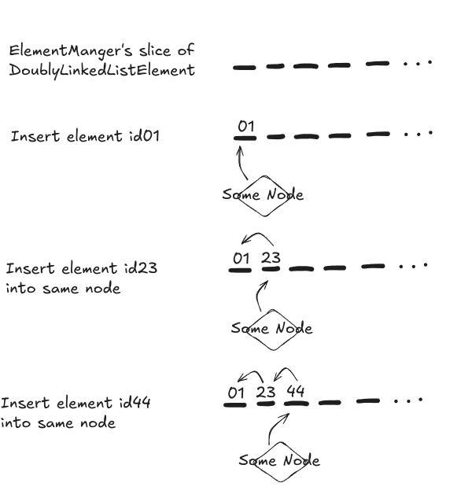
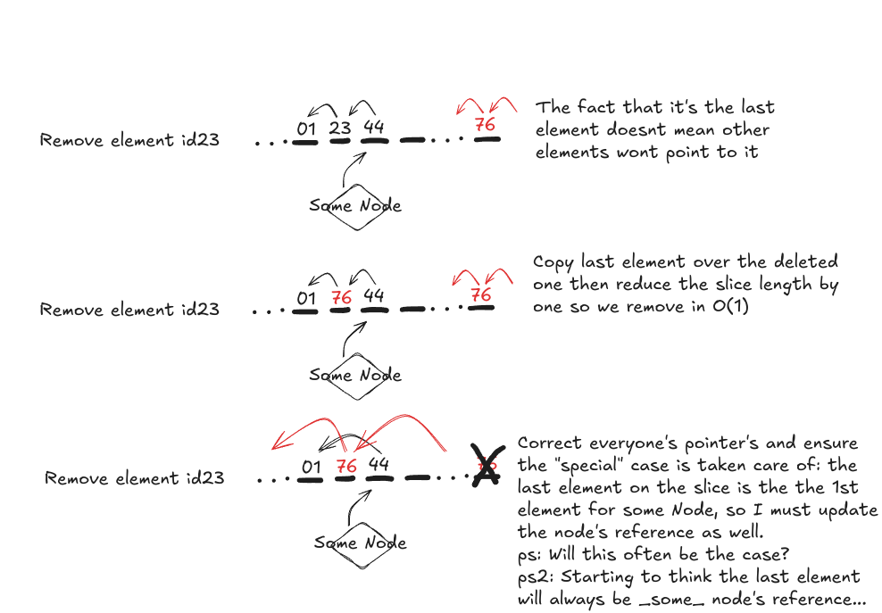

# Simple Quadtree

## Main concepts

* Nodes store each element via a linked list.
* Nodes only have a reference to the 1st element on this linked list.
* Elements get inserted via the `ElementManager` which stores a slice of `DoublyLinkedListElement`
* Elements are appended to the slice and form a linked list.  

📣 At the moment, each time an element is added, the node's reference is updated to point to that element. This means that 
the node is always pointing to the element with the largest index in the Slice.
In other words, the node points to the last element on the linked list.

So after adding 3 elements with ID's a, b and c we'd have:

```
node's reference = 2
Slice = [a, b, c]
a.prev = -1
a.next = 1
b.prev = 0
b.next = 2
c.prev = 1
c.next = -1
```

**2024-08-04** This may seem like an oversight left over from a singly linked list. However if the node's reference 
pointed to the 1st element, every time an element was added, we'd have to follow the entire linked list to reach the 
last element in order to update it's `nextElement` reference.
By point to the last element, it's 2 ops: update node reference and ensure `newElement.previousElement` points to the 
old node reference.
ps: We could of course hold *2 references*, one the 1st element and one to the last... 

## TODO:

1. Divide
2. Combine

## Diagrams:

Arrows pointing left are "nextElement" and pointing right, "prevElement".

### Adding elements


### Removing elements



